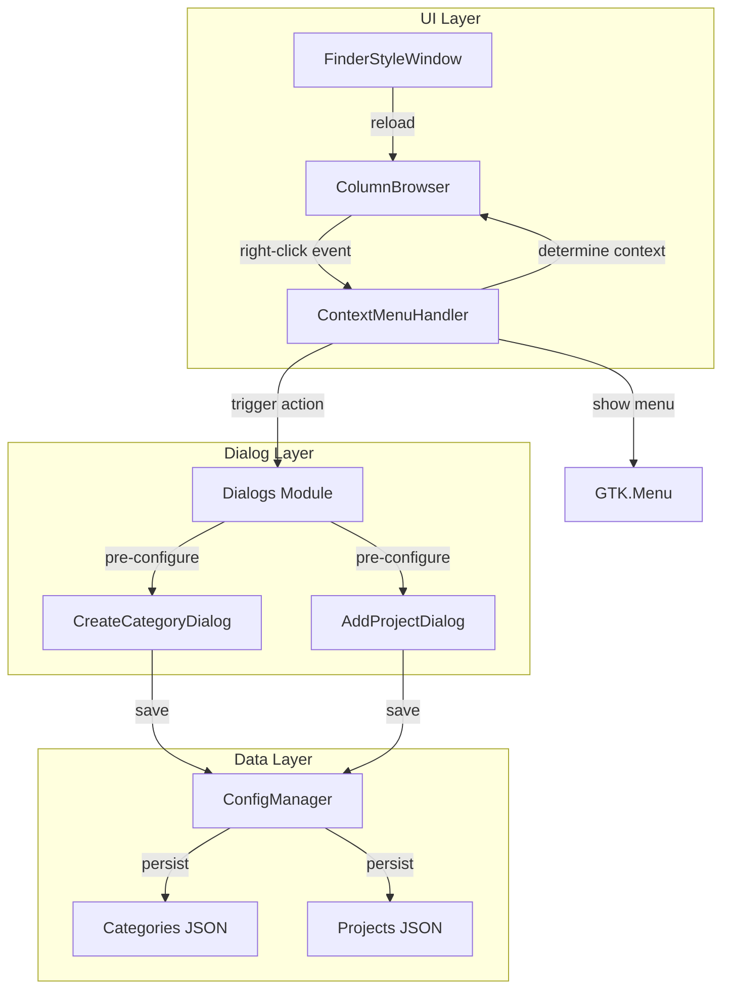
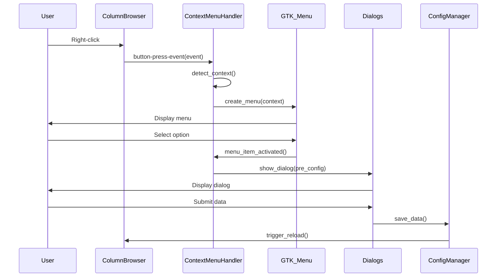

# Design Document: Context Menu Navigation

## Overview

Este diseño implementa menús contextuales (click derecho) para el navegador de columnas estilo Finder del VSCode Project Launcher. La solución reemplaza los botones del header con menús contextuales que aparecen según el contexto, proporcionando una experiencia más intuitiva y similar a navegadores de archivos modernos como Finder o Nautilus.

La implementación se basa en GTK3 y Python, extendiendo la clase `ColumnBrowser` existente para manejar eventos de click derecho y mostrar menús contextuales apropiados. Los diálogos existentes (`show_create_category_dialog`, `show_add_project_dialog`) serán reutilizados con pre-configuración basada en el contexto.

### Key Design Decisions

1. **Event-driven architecture**: Usar señales GTK (`button-press-event`) para capturar clicks derechos
2. **Context detection**: Determinar el contexto basándose en `current_path` de la columna y el item seleccionado
3. **Dialog reuse**: Extender los diálogos existentes para aceptar parámetros de pre-configuración
4. **Minimal UI changes**: Remover solo los botones de creación del header, mantener configuración y "Abrir en VSCode"

## Architecture

### Component Diagram



### Interaction Flow



## Components and Interfaces

### 1. ContextMenuHandler

Nueva clase que gestiona la creación y manejo de menús contextuales.

**Responsibilities:**
- Detectar el contexto del click derecho (columna raíz, columna hija, item de categoría, item de proyecto)
- Crear el menú GTK apropiado según el contexto
- Conectar las acciones del menú con los callbacks correspondientes
- Extraer información de jerarquía del path actual

**Interface:**

```python
class ContextMenuHandler:
    def __init__(self, column_browser, parent_window):
        """
        Initialize context menu handler

        Args:
            column_browser: ColumnBrowser instance
            parent_window: FinderStyleWindow instance
        """
        pass

    def on_button_press(self, widget, event) -> bool:
        """
        Handle button press events (right-click detection)

        Args:
            widget: GTK widget that received the event
            event: Gdk.EventButton

        Returns:
            True if event was handled, False otherwise
        """
        pass

    def detect_context(self, event) -> dict:
        """
        Detect the context of the right-click

        Args:
            event: Gdk.EventButton

        Returns:
            Dictionary with context information:
            {
                'type': 'root_column' | 'child_column' | 'category_item' | 'project_item',
                'hierarchy_path': str,
                'item_path': str | None,
                'is_project': bool
            }
        """
        pass

    def create_context_menu(self, context: dict) -> Gtk.Menu:
        """
        Create appropriate context menu based on context

        Args:
            context: Context dictionary from detect_context()

        Returns:
            Configured Gtk.Menu
        """
        pass

    def show_menu(self, menu: Gtk.Menu, event):
        """
        Display the context menu at cursor position

        Args:
            menu: Gtk.Menu to display
            event: Gdk.EventButton for positioning
        """
        pass
```

### 2. Enhanced ColumnBrowser

Extensión de la clase existente para soportar menús contextuales.

**New Methods:**

```python
class ColumnBrowser(Gtk.ScrolledWindow):
    # ... existing code ...

    def setup_context_menu(self):
        """
        Initialize context menu handler and connect signals
        """
        pass

    def get_item_at_position(self, x: int, y: int) -> tuple:
        """
        Get the item (if any) at the given coordinates

        Args:
            x: X coordinate
            y: Y coordinate

        Returns:
            Tuple of (TreePath, TreeViewColumn) or (None, None)
        """
        pass

    def is_root_column(self) -> bool:
        """
        Check if this column is the root categories column

        Returns:
            True if current_path is "categories" or None
        """
        pass

    def get_hierarchy_info(self) -> dict:
        """
        Extract hierarchy information from current_path

        Returns:
            Dictionary with:
            {
                'level': int,  # 0 for root, 1+ for nested
                'category': str | None,
                'subcategory_path': str | None,
                'full_path': str
            }
        """
        pass
```

### 3. Enhanced Dialogs Module

Extensión de los diálogos existentes para aceptar pre-configuración.

**Modified Signatures:**

```python
class Dialogs:
    @staticmethod
    def show_create_category_dialog(
        parent,
        categories,
        on_create_callback,
        pre_config: dict = None
    ):
        """
        Show category creation dialog with optional pre-configuration

        Args:
            parent: Parent window
            categories: Categories dictionary
            on_create_callback: Callback function
            pre_config: Optional dictionary with:
                {
                    'parent_category': str | None,  # Pre-select parent
                    'force_subcategory': bool,      # Force subcategory mode
                    'hierarchy_path': str | None    # Full hierarchy path
                }
        """
        pass

    @staticmethod
    def show_add_project_dialog(
        parent,
        categories,
        on_add_callback,
        pre_config: dict = None
    ):
        """
        Show project creation dialog with optional pre-configuration

        Args:
            parent: Parent window
            categories: Categories dictionary
            on_add_callback: Callback function
            pre_config: Optional dictionary with:
                {
                    'category': str | None,         # Pre-select category
                    'subcategory': str | None,      # Pre-select subcategory
                    'hierarchy_path': str | None    # Full hierarchy path
                }
        """
        pass
```

### 4. Modified FinderStyleWindow

Cambios en la ventana principal para remover botones y soportar menús contextuales.

**Changes:**

```python
class FinderStyleWindow(Gtk.Window):
    def setup_ui(self):
        """
        Modified to:
        - Remove "Crear nueva categoría" button
        - Remove "Añadir nuevo proyecto" button
        - Keep configuration button
        - Keep "Abrir en VSCode" button
        """
        pass

    def on_context_menu_action(self, action: str, context: dict):
        """
        Handle actions triggered from context menus

        Args:
            action: Action identifier ('create_category', 'add_project', 'open_vscode')
            context: Context dictionary with hierarchy information
        """
        pass
```

## Data Models

### Context Information Model

```python
@dataclass
class ContextInfo:
    """Information about the context of a right-click event"""

    context_type: str  # 'root_column', 'child_column', 'category_item', 'project_item'
    hierarchy_path: str  # Current hierarchy path (e.g., "cat:Web:Frontend")
    item_path: Optional[str]  # Path of clicked item (if any)
    is_project: bool  # True if clicked item is a project
    level: int  # Hierarchy level (0 for root, 1+ for nested)
    category: Optional[str]  # Category name (if applicable)
    subcategory_path: Optional[str]  # Subcategory path (if applicable)
```

### Pre-configuration Model

```python
@dataclass
class DialogPreConfig:
    """Pre-configuration data for dialogs"""

    parent_category: Optional[str]  # Parent category for subcategory creation
    force_subcategory: bool  # Force dialog into subcategory mode
    hierarchy_path: Optional[str]  # Full hierarchy path
    category: Optional[str]  # Pre-selected category for projects
    subcategory: Optional[str]  # Pre-selected subcategory for projects
    disable_category_selection: bool  # Disable category selection in dialog
```

### Menu Action Model

```python
@dataclass
class MenuAction:
    """Represents an action in a context menu"""

    label: str  # Display label for menu item
    action_id: str  # Unique identifier for the action
    icon_name: Optional[str]  # GTK icon name
    callback: Callable  # Function to call when selected
    context: ContextInfo  # Context information for the action
```


## Correctness Properties

*A property is a characteristic or behavior that should hold true across all valid executions of a system—essentially, a formal statement about what the system should do. Properties serve as the bridge between human-readable specifications and machine-verifiable correctness guarantees.*

### Property 1: Context Menu Display on Right-Click

*For any* valid right-click event (on empty column area or on an item), the system should create and display a GTK context menu at the cursor position and prevent the default GTK context menu from appearing.

**Validates: Requirements 1.1, 1.2, 1.3**

### Property 2: Context-Appropriate Menu Contents

*For any* context type (root column, child column, category item, project item), the generated context menu should contain exactly the menu options appropriate for that context type:
- Root column: "Crear categoría", "Agregar proyecto"
- Child column: "Agregar subcategoría", "Agregar proyecto"
- Category item: "Agregar subcategoría"
- Project item: "Abrir en VSCode"

**Validates: Requirements 2.1, 2.2, 3.1, 3.2, 4.1, 5.1**

### Property 3: Dialog Pre-configuration from Context

*For any* context menu action that opens a dialog (create category, add project), the dialog should be called with pre-configuration parameters that correctly reflect the context's hierarchy information (parent category, current category, subcategory path).

**Validates: Requirements 2.3, 2.4, 3.3, 3.4, 5.2, 6.3, 6.4, 7.3**

### Property 4: Hierarchy Path Extraction

*For any* column or item with a path attribute (current_path or full_path), the context detection should correctly extract and parse the hierarchy information (level, category, subcategory path).

**Validates: Requirements 6.1, 6.2**

### Property 5: VSCode Project Opening

*For any* project item, when "Abrir en VSCode" is selected from the context menu, the system should call open_vscode_project with the correct project path and close the launcher window upon success.

**Validates: Requirements 4.2, 4.3**

### Property 6: Interface Refresh After Creation

*For any* successful creation of a category, subcategory, or project through a context menu action, the interface should be refreshed to display the newly created item.

**Validates: Requirements 5.3**

### Property 7: Dialog Centering

*For any* dialog opened from a context menu, the dialog should be displayed centered on the parent window.

**Validates: Requirements 9.3**

### Property 8: Error Dialog on Failure

*For any* context menu action that fails during execution, the system should display an error dialog with a descriptive message.

**Validates: Requirements 9.4**

## Error Handling

### Error Scenarios

1. **Invalid Hierarchy Path**
   - **Scenario**: Context detection encounters a malformed hierarchy path
   - **Handling**: Log error, fall back to root column context, show error dialog to user
   - **Recovery**: Allow user to continue with root-level operations

2. **Dialog Creation Failure**
   - **Scenario**: Dialog fails to open due to missing parent window or invalid pre-config
   - **Handling**: Log error with stack trace, show error dialog
   - **Recovery**: User can retry action or use configuration dialog as fallback

3. **VSCode Launch Failure**
   - **Scenario**: open_vscode_project fails (VSCode not installed, invalid path, etc.)
   - **Handling**: Use existing error handling in open_vscode_project function
   - **Recovery**: Show error dialog, keep launcher window open

4. **Menu Creation Failure**
   - **Scenario**: Context menu fails to create due to invalid context
   - **Handling**: Log error, show default menu with safe options
   - **Recovery**: User can try again or use header buttons (if available)

5. **Configuration Save Failure**
   - **Scenario**: New category/project fails to save to JSON
   - **Handling**: Use existing ConfigManager error handling
   - **Recovery**: Show error dialog, allow user to retry

### Error Propagation

```python
def on_button_press(self, widget, event) -> bool:
    """Handle button press with error recovery"""
    try:
        if event.button == 3:  # Right-click
            context = self.detect_context(event)
            menu = self.create_context_menu(context)
            self.show_menu(menu, event)
            return True  # Event handled
    except InvalidHierarchyPathError as e:
        logger.error(f"Invalid hierarchy path: {e}")
        self.show_error_dialog("Error al detectar contexto")
        return True  # Prevent default menu
    except Exception as e:
        logger.error(f"Unexpected error in context menu: {e}")
        self.show_error_dialog("Error al mostrar menú contextual")
        return True

    return False  # Let other handlers process
```

## Testing Strategy

### Dual Testing Approach

This feature will be tested using both unit tests and property-based tests:

- **Unit tests**: Verify specific examples, edge cases, and GTK integration points
- **Property tests**: Verify universal properties across all input variations

### Unit Testing Focus

Unit tests should cover:

1. **GTK Integration Examples**
   - Specific example: Right-click on root column shows correct menu
   - Specific example: Right-click on project item shows "Abrir en VSCode"
   - Edge case: Right-click on empty column area
   - Edge case: Right-click during column transition

2. **Dialog Integration Examples**
   - Specific example: Dialog opens with pre-configured parent category
   - Specific example: Dialog fields are disabled when pre-configured
   - Integration: Dialog callback triggers interface reload

3. **UI State Examples**
   - Specific example: Header buttons are removed after initialization
   - Specific example: Configuration button remains in header
   - Edge case: Menu closes on Escape key press
   - Edge case: Menu closes on outside click

### Property-Based Testing Focus

Property tests should verify universal behaviors across randomized inputs:

1. **Context Detection Properties** (Property 4)
   - Generate random hierarchy paths (valid format)
   - Verify correct parsing of level, category, subcategory
   - Minimum 100 iterations per test

2. **Menu Content Properties** (Property 2)
   - Generate random context types
   - Verify menu contains exactly the required options
   - Verify no extra or missing options
   - Minimum 100 iterations per test

3. **Pre-configuration Properties** (Property 3)
   - Generate random hierarchy contexts
   - Verify dialog receives correct pre-config parameters
   - Verify parameters match the context's hierarchy
   - Minimum 100 iterations per test

4. **Path Extraction Properties** (Property 4)
   - Generate random valid paths (cat:Name, cat:Name:Sub, etc.)
   - Verify extraction produces correct hierarchy info
   - Test round-trip: context → path → context
   - Minimum 100 iterations per test

### Property-Based Testing Configuration

- **Library**: Use `hypothesis` for Python property-based testing
- **Iterations**: Minimum 100 iterations per property test
- **Tagging**: Each test must reference its design property

Example tag format:
```python
# Feature: context-menu-navigation, Property 2: Context-Appropriate Menu Contents
@given(context_type=st.sampled_from(['root_column', 'child_column', 'category_item', 'project_item']))
def test_menu_contents_match_context(context_type):
    # Test implementation
    pass
```

### Test Coverage Goals

- **Line coverage**: Minimum 85% for new code
- **Branch coverage**: Minimum 80% for context detection logic
- **Integration coverage**: All dialog pre-configuration paths tested
- **Property coverage**: All 8 correctness properties implemented as tests

### Testing Phases

1. **Phase 1: Unit Tests** - Test specific examples and GTK integration
2. **Phase 2: Property Tests** - Test universal properties with randomization
3. **Phase 3: Integration Tests** - Test end-to-end flows with real GTK widgets
4. **Phase 4: Manual Testing** - Verify visual feedback and user experience
